# StockApp

A full-stack stock research and paper-trading app. Search any US-listed company with autocomplete, see its quote (auto-refreshing every 15 seconds), company profile, news, interactive historical charts with technical indicators, analyst recommendations and insider sentiment, then keep a watchlist and a simulated portfolio with a cash wallet. The Angular frontend talks only to a Node/Express backend, which proxies Finnhub and Polygon.io through a server-side TTL cache with a background quote-refresh job, and stores the watchlist and portfolio in MongoDB Atlas. The backend is deployed on Google Cloud Run.

| Stock details | Historical charts |
| --- | --- |
| 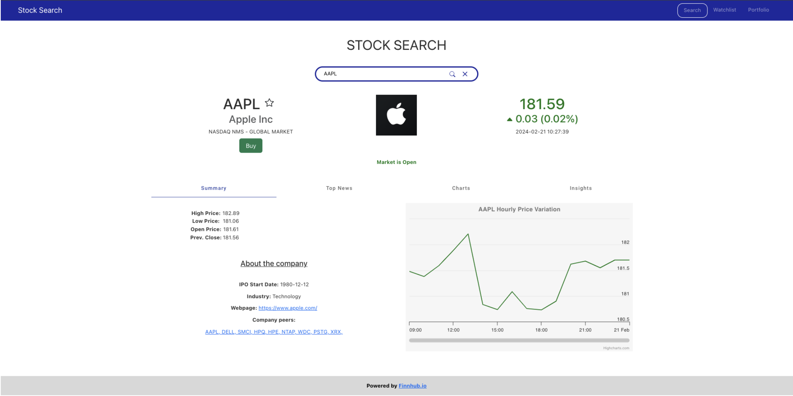 | 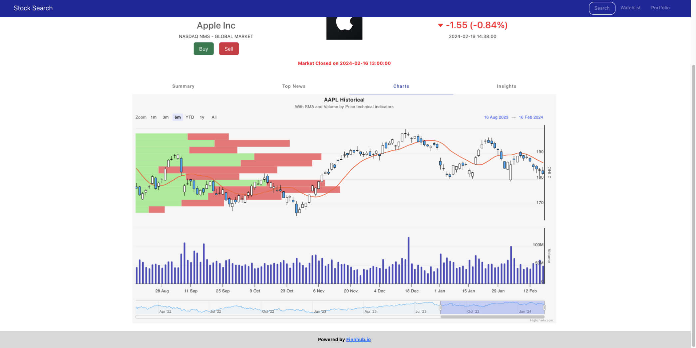 |
| **Portfolio** | **Watchlist** |
| 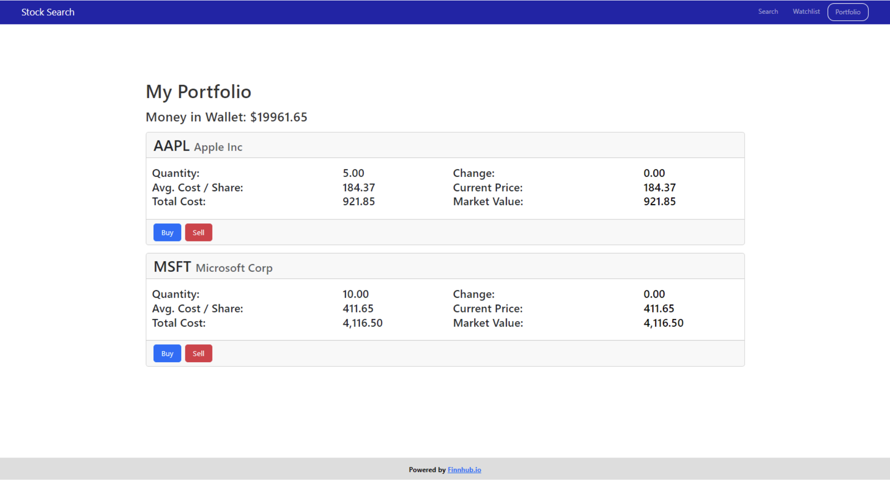 | 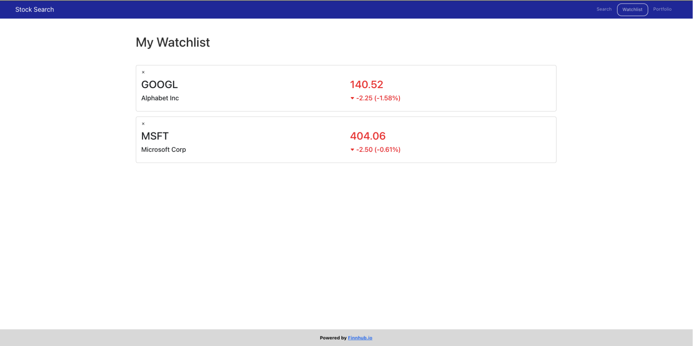 |

More screenshots (news, insights, buy/sell modals, autocomplete, mobile layout) are in the [gallery](#more-screenshots) below.

## Features

- **Search with autocomplete** — typeahead limited to common stocks.
- **Stock details** — price, change, market open/closed status; the quote auto-refreshes every 15 seconds while the page is open (client polling).
- **Tabs** — Summary (hourly price chart, company info, peers), Top News, Charts (6-month candlestick with SMA and volume-by-price via Highcharts Stock), Insights (insider sentiment, recommendation trends, EPS surprises).
- **Watchlist** — add/remove tickers with a star; stored in MongoDB.
- **Portfolio** — simulated wallet with buy/sell modals and per-holding P/L. Trades are priced on the server from the current quote, and the server rejects buys that exceed the wallet balance or sells that exceed the shares held.
- **Responsive** layout for desktop and mobile.

## Architecture

```
Angular 17 SPA  ──HTTP──▶  Express API (main.js)  ──▶  Finnhub / Polygon.io
                              │  ├─ TTL cache (server/cache.js)
                              │  └─ background quote refresh (server/refreshJob.js)
                              └──────────────────▶  MongoDB Atlas (watchlist, portfolio)
```

- **Frontend** (`src/`): Angular 17, Angular Material, ng-bootstrap, Highcharts. The API base URL comes from `src/environments/` (`localhost:3000` in development, the Cloud Run URL in production builds).
- **Backend** (`main.js`, `server/`): Express API under `/api/*`. API keys never reach the browser.
  - **TTL cache** — every Finnhub/Polygon call goes through an in-memory cache: quotes 15s, news 10 min, summary chart 10 min, historical data and search 1h, profile/peers/recommendations/earnings/insider sentiment 24h. Concurrent requests for the same key share one upstream call.
  - **Background refresh** — a `setInterval` job (every 12s by default, set with `QUOTE_REFRESH_MS`) refreshes quotes for every symbol in the watchlist and portfolio, so those endpoints are served from cache. Quotes for multiple symbols are fetched in parallel.
- **Database**: MongoDB Atlas, `portfolio` and `watchlist` collections.

## Running locally

Requires Node.js 20+, a [Finnhub](https://finnhub.io) API key, a [Polygon.io](https://polygon.io) API key and a MongoDB connection string.

```bash
npm install
cp .env.example .env   # then fill in the values
```

| Variable | Required | Description |
| --- | --- | --- |
| `FINNHUB_API_KEY` | yes | Finnhub API key |
| `POLYGON_API_KEY` | yes | Polygon.io API key |
| `MONGODB_URI` | yes | MongoDB connection string |
| `MONGO_DB_NAME` | no | Database name (default `stockapp`) |
| `PORT` | no | Backend port (default `3000`) |
| `QUOTE_REFRESH_MS` | no | Background quote refresh interval in ms (default `12000`) |

The server exits with a clear error if a required variable is missing. The portfolio endpoints expect a single document in the `portfolio` collection, e.g. `{ "Balance": 25000, "Stocks": [] }`.

**Backend** (http://localhost:3000):

```bash
npm run start:server
```

**Frontend** (http://localhost:4200, calls the local backend):

```bash
npm start
```

**Production build** (uses `src/environments/environment.prod.ts`):

```bash
npx ng build
```

## Tests

```bash
npm run test:server                                   # backend: node:test, no network or database needed
npx ng test --watch=false --browsers=ChromeHeadless   # frontend component specs (Karma)
```

The backend tests use a fake Finnhub HTTP layer and an in-memory store. They cover cache expiry and de-duplication, cache hits avoiding upstream calls, the background job warming watchlist/portfolio quotes, server-side trade validation, and the watchlist add/list/remove round trip. CI (`.github/workflows/ci.yml`) runs the backend tests and the production build on every push and pull request.

## More screenshots

<p align="center">
  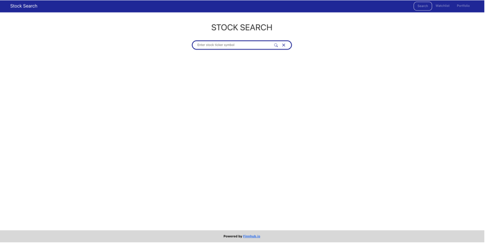
  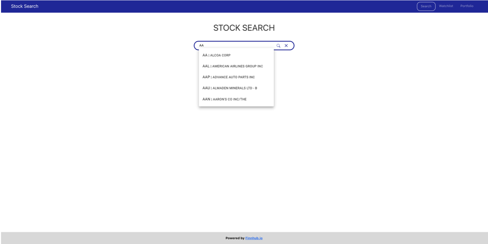
</p>
<p align="center">
  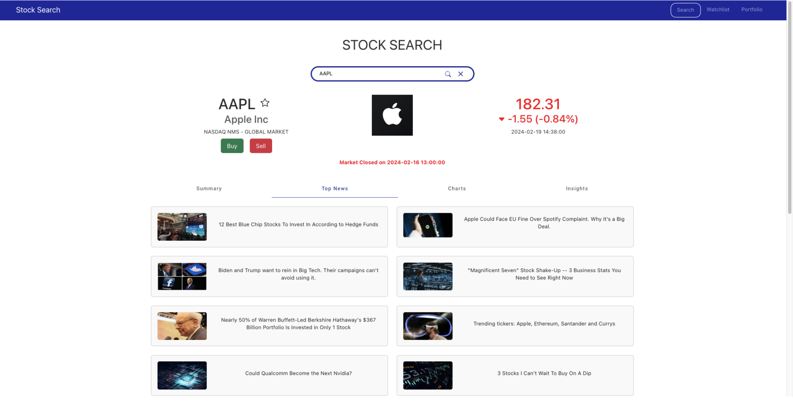
  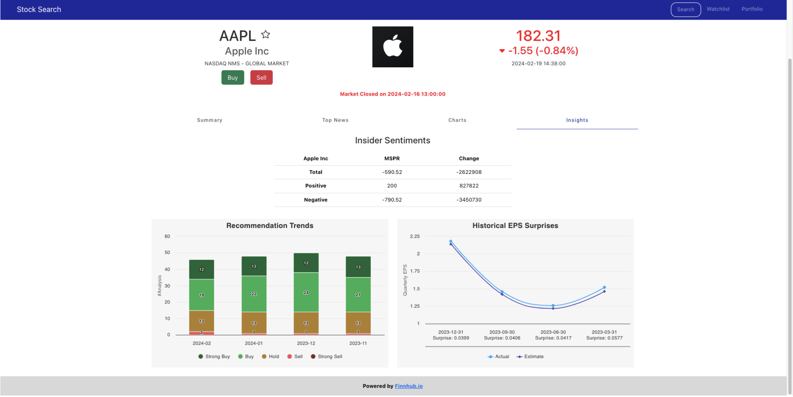
</p>
<p align="center">
  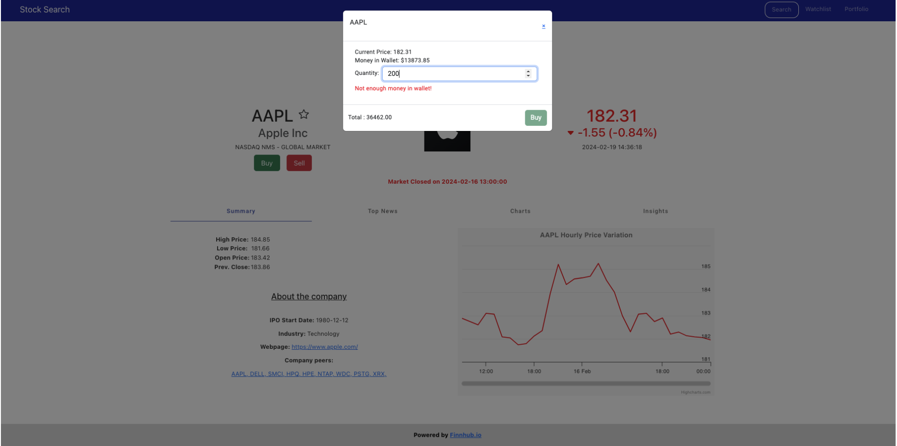
  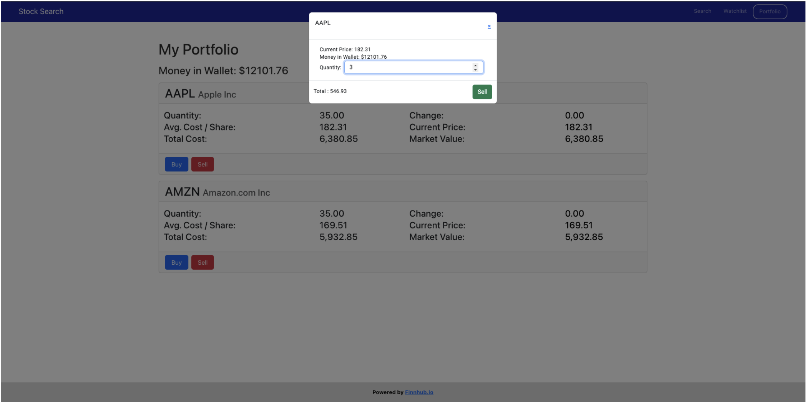
</p>
<p align="center">
  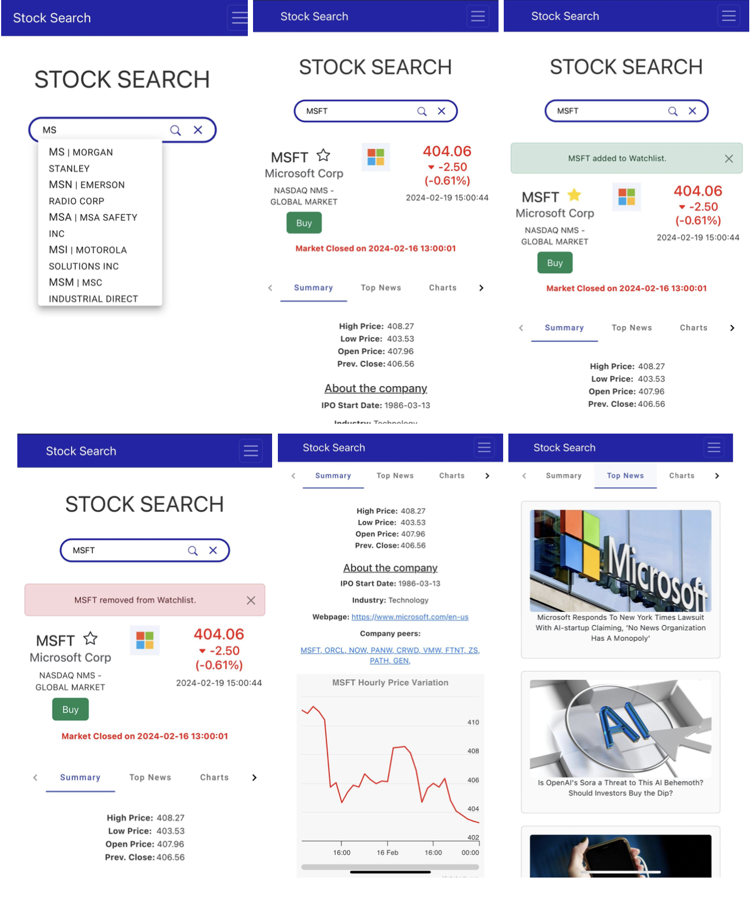
</p>

## License

[MIT](LICENSE)
