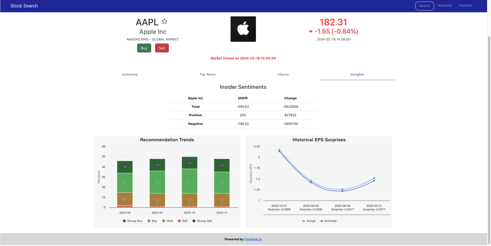

# StockApp — Angular + Node (Stocks Search)

Single-page Angular app with a minimal Node/Express backend (proxy) that serves stock data and UI features like autocomplete, quotes, charts, news, watchlist, and portfolio.

> **Note**: This repository contains only the source code. Deployment artifacts (e.g., App Engine config, builds) are intentionally excluded.

## Tech Stack
- **Frontend**: Angular, Angular Material, Bootstrap (responsive)
- **Charts**: Highcharts (via highcharts-angular)
- **Backend**: Node/Express proxy (all API calls go through server)
- **Data**: Finnhub, Polygon.io
- **Database**: MongoDB Atlas (watchlist & portfolio)

## Key Features
- Search with **autocomplete** (typeahead filters common stocks)
- Ticker **details page** with market status, price, and summary
- **Tabs**: Summary • Top News • Charts • Insights
- **Watchlist** (MongoDB): add/remove tickers with alerts
- **Portfolio** (MongoDB): wallet, buy/sell modals, P/L updates
- **Responsive** layout (desktop & mobile)

## 📸 Preview

<p align="center">
  
  
</p>
<p align="center">
  
  
</p>
<p align="center">
  
  
</p>
<p align="center">
  
  
</p>
<p align="center">
  
  
</p>
<p align="center">
  
</p>

## Local Development
```bash
# From repo root (this folder)
npm install   # or pnpm i / yarn

# Start Angular dev server
npm run start
# App on http://localhost:4200
